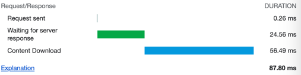

# How to refresh this dataset

```bash
node download-all.js
bash download-all.sh
cd boundaries
gunzip *
```

This downloads all the countries with simplified 0.0001 geometries.
It downloads 17 MB of gzipped data, 52 MB of raw geojsons. The biggest file is 2 MB.

# v1

```bash
node process-boundaries.js
```

Generates 20768 files of files (530 MB), each folder max 4 MB.
Biggest files is 777 kB ([v1/88/26.geojson](./v1/88/26.geojson)).
Takes 7h on Macbook M1 Air.

Download options:
- https://github.com/zbycz/which-country/blob/main/create/v1/88/26.geojson
- https://cdn.jsdelivr.net/gh/zbycz/which-country/dist/create/v1/88/26.geojson
- https://zbycz.github.io/which-country/create/v1/14/50.geojson
  -  moderately big (270kB raw) is 87ms in gzip:
    
    After cache hit, it goes down to 30ms. 
    // TODO find if files can be permanent Expire +10y ..


     

# v2

```bash
node process-boundaries2.js
```

v1/14/50.geojson = 269kB pretty json
v2/14/50.geojson = 60kb no spaces, less tags
v2/14/50.geojson = 53kb with rounded to 5 decimals


# notes

TODO
use polyline eg
const polyline = require('@mapbox/polyline');
const polyline = require('@googlemaps/polyline-codec');
- but the handle only linestrings, not polygons


// find biggest file in folder recursively using ls:
```bash
ls -lR | grep -v '^d' | sort -k5 -n -r | head -n 10
```

